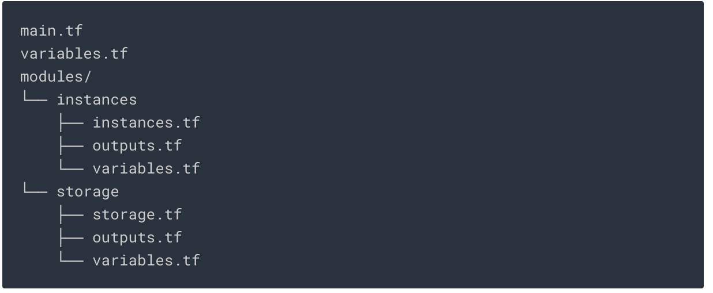

# Automating Infrastructure on Google Cloud with Terraform: Challenge Lab
## Task 1. Create the configuration files


```bash
touch main.tf variables.tf
mkdir -p modules/instances
cd modules/instances
touch outputs.tf variables.tf instances.tf
cd ~
mkdir -p modules/storage
cd modules/storage
touch outputs.tf variables.tf storage.tf
cd ~
```
+ Add following to [variables.tf](4_terraform/variables.tf)
```json
variable "region" {
 default = "us-central1"
}

variable "zone" {
 default = "us-central1-a"
}

variable "project_id" {
 default = "qwiklabs-gcp-00-03b8a5bdcdb4"
}
```
+ Add the Terraform block and the Google Provider to the [main.tf](4_terraform/main.tf) file.
```json
terraform {
  required_providers {
    google = {
      source = "hashicorp/google"
      version = "3.55.0"
    }
  }
}
```

## Task 2. Import infrastructure
### Import the existing instances into the instances module.
+ Write the resource configuration([instances.tf](4_terraform/modules/instances/instances.tf)) to match the pre-existing instances.
+ Add the module reference into the main.tf file.
```bash
module "instances" {

  source     = "./modules/instances"

}
```

+ Use the terraform import command to import them into your instances module.

```bash
terraform import module.instances.google_compute_instance.tf-instance-1 5649082071433810691

terraform import module.instances.google_compute_instance.tf-instance-2 2356167161402561283
terraform plan
terraform apply
```

## Task 3. Configure a remote backend

+ Create a Cloud Storage bucket resource inside the storage module([storage.tf](4_terraform/modules/storage/storage.tf))
```json
resource "google_storage_bucket" "storage-bucket" {
  name          = var.project_id
  location      = "US"
  force_destroy = true
  uniform_bucket_level_access = true
}
```
```bash
terraform init
terraform apply
```
+ Add the module reference to the [main.tf](4_terraform/main.tf) file
```json
module "storage" {
  source     = "./modules/storage"
}
```
```bash
terraform init
terraform apply
```
+ Configure this storage bucket as the remote backend inside the [main.tf](4_terraform/main.tf) file
```json
terraform {
  backend "gcs" {
    bucket  = "qwiklabs-gcp-00-03b8a5bdcdb4"
 prefix  = "terraform/state"
  }
  required_providers {
    google = {
      source = "hashicorp/google"
      version = "3.55.0"
    }
  }
}
```

```bash
terraform init
```

## Task 4. Modify and update infrastructure

+ Modify the `tf-instance-1` abd `tf-instance-2` resource to use an n1-standard-2 machine type
+ Add a third instance resource and name it tf-instance-3. For this third resource, use an n1-standard-2 machine type
```json
resource "google_compute_instance" "tf-instance-3" {
  name         = "tf-instance-3"
  machine_type = "n1-standard-2"
  zone         = var.zone
  allow_stopping_for_update = true
  boot_disk {
    initialize_params {
      image = "debian-cloud/debian-10"
    }
  }

  network_interface {
 network = "default"
  }
}
```
```bash
terraform init
terraform apply
```

## Task 5. Taint and destroy resources
+ Taint the third instance tf-instance-3, and then plan and apply your changes to to recreate it.
```bash
terraform taint module.instances.google_compute_instance.tf-instance-3
terraform init
terraform apply
```
+ Destroy the third instance tf-instance-3 by removing the resource from the configuration file. 
+ Refer to [instances.tf](4_terraform/modules/instances/instances.tf) where the third instances is commented

```bash
terraform apply
```

## Task 6. Use a module from the Registry
+ Add following to [main.tf](4_terraform/main.tf)

```json
module "vpc" {
    source  = "terraform-google-modules/network/google"
    version = "~> 2.5.0"

    project_id   = var.project_id
    network_name = "terraform-vpc"
    routing_mode = "GLOBAL"

    subnets = [
        {
            subnet_name           = "subnet-01"
            subnet_ip             = "10.10.10.0/24"
            subnet_region         = "us-central1"
        },
        {
            subnet_name           = "subnet-02"
            subnet_ip             = "10.10.20.0/24"
            subnet_region         = "us-central1"
            subnet_private_access = "true"
            subnet_flow_logs      = "true"
            description           = "This subnet has a description"
        }
    ]
}
```
```bash
terraform init
terraform apply
```
+ Add following to network block [instances.tf](4_terraform/modules/instances/instances.tf)
+ This will connect `tf-instance-1` to `subnet-01` and `tf-instance-2` to `subnet-02`
```json
 network_interface {
 network = "terraform-vpc"
    subnetwork = "subnet-01"
  }
}
 network_interface {
 network = "terraform-vpc"
    subnetwork = "subnet-02"
  }
}
```

## Task 7. Configure a firewall

+ Create a firewall rule resource in the [main.tf](4_terraform/main.tf)file, and name it tf-firewall. This firewall rule should permit the terraform-vpc network to allow ingress connections on all IP ranges (0.0.0.0/0) on TCP port 80.

```json
resource "google_compute_firewall" "tf-firewall" {
  name    = "tf-firewall"
 network = "projects/qwiklabs-gcp-00-03b8a5bdcdb4/global/networks/terraform-vpc"

  allow {
    protocol = "tcp"
    ports    = ["80"]
  }

  source_tags = ["web"]
  source_ranges = ["0.0.0.0/0"]
}
```
```bash
terraform apply
```