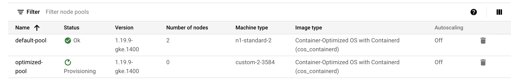
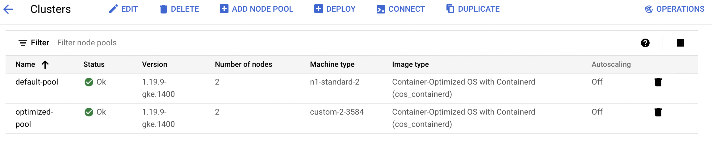

# [Optimize Costs for Google Kubernetes Engine: Challenge Lab](https://www.qwiklabs.com/focuses/16327?parent=catalog)

Few steps to followed:

+ Create the cluster in the `us-central1` region
+ The naming scheme is team-resource, e.g. a cluster could be named `onlineboutique-cluster`
+ For your initial cluster, start with machine size `n1-standard-2` (2 vCPU, 8G memory)

## Task 1: Create our cluster and deploy our app
+ Start small and make a zonal cluster with only two (2) nodes.

```bash
gcloud config set compute/zone us-central1-a 
gcloud container clusters create onlineboutique-cluster \
   --project=${DEVSHELL_PROJECT_ID} --zone=us-central1-a \
    --machine-type=n1-standard-2 --num-nodes=2
```
+ Create namespace `dev` and `prod` and set config to dev
```bash
kubectl create namespace dev
kubectl create namespace prod
kubectl config set-context --current --namespace dev
```
+ Download the application and deploy the application to `dev` namespace
```bash
git clone https://github.com/GoogleCloudPlatform/microservices-demo.git &&
cd microservices-demo && kubectl apply -f ./release/kubernetes-manifests.yaml 
```
+ Wait till the service is up(external ip is allocated) and check website
```bash
kubectl get svc frontend-external -w 
```
+ Go to http://[EXTERNAL_IP]


## Task 2: Migrate to an Optimized Nodepool

+ Create a new node pool named optimized-pool with custom-2-3584 as the machine type. Set the number of nodes to 2
```bash
gcloud container node-pools create optimized-pool \
   --cluster=onlineboutique-cluster \
   --machine-type=custom-2-3584 \
   --num-nodes=2 \
   --zone=us-central1-a
```
+ Wait till nodepool status is `OK`


+ When status is okay


+ Cordon and drain the `default-pool`
```bash
for node in $(kubectl get nodes -l cloud.google.com/gke-nodepool=default-pool -o=name); do
   kubectl cordon "$node";
done
   
for node in $(kubectl get nodes -l cloud.google.com/gke-nodepool=default-pool -o=name); do
   kubectl drain --force --ignore-daemonsets --delete-local-data --grace-period=10 "$node";
done
```
+ Verify nodes are running in new nodepool

```bash
kubectl get pods -o=wide 
```

+ Delete the default pool
```
gcloud container node-pools delete default-pool \
   --cluster onlineboutique-cluster --zone us-central1-a
```
## Task 3: Apply a Frontend Update

+ Set a pod disruption budget for your `frontend` deployment. 
+ Name it `onlineboutique-frontend-pdb`  
+ Set the `min-availability` of your deployment to 1.
```bash
kubectl create poddisruptionbudget onlineboutique-frontend-pdb \
--selector app=frontend --min-available 1  
```

+ Update the docker image to `gcr.io/qwiklabs-resources/onlineboutique-frontend:v2.1`
```bash
KUBE_EDITOR="nano" 
kubectl edit deployment/frontend 
````

## Task 4: Autoscale from Estimated Traffic

+ Apply horizontal pod autoscaling to your frontend deployment in order to handle the traffic surge.
 Scale based off a target cpu percentage of 50 and set the pod scaling between 1 minimum and 13 maximum

 ```bash
 kubectl autoscale deployment frontend --cpu-percent=50 \
   --min=1 --max=13
kubectl get hpa
 ```

+ Update your `cluster autoscaler` to scale between `1 node minimum` and `6 nodes maximum`.

```bash
gcloud beta container clusters update onlineboutique-cluster \
   --enable-autoscaling --min-nodes 1 --max-nodes 6 --zone us-central1-a
```
+ Observe the work load

```bash
kubectl exec $(kubectl get pod --namespace=dev \
| grep 'loadgenerator' | cut -f1 -d ' ') -it --namespace=dev -- bash -c "export USERS=8000; sh ./loadgen.sh"
```